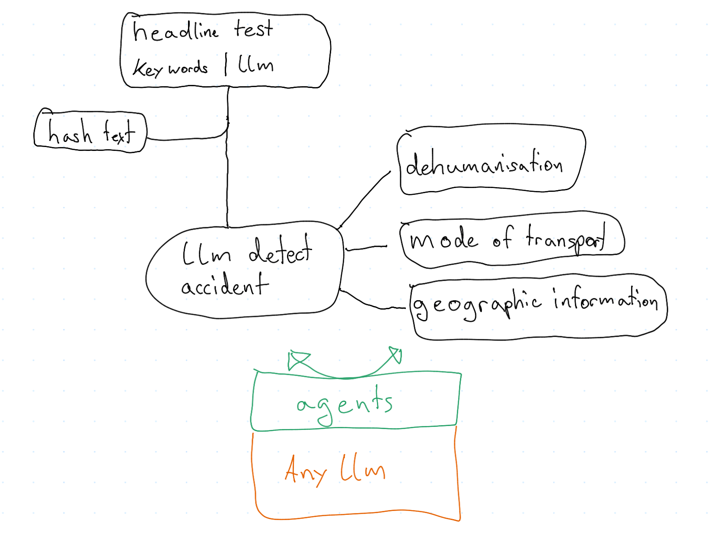

### Dehumanising detectors

## Schematics

## TODO
 - Implement suprabase
 - Implement telegram bot (https://python-telegram-bot.org/)
 - Create mathematical model that automatically calculates human eval. 

# Suprabase
Suprabase is a easy to use real-time database. 
The advantage of using a real-time database is that the same data can be administred from different devices at the same time. This way we can upload new articles make data analysis at the same time without data collision or doing the same computation twice. 

# Telegram bot
Becaues we need to evaluate our model(s) performance we need volunteers that evaluate texts for us. 
A telegram bot is very well suited for that task because its very easy to use, we can reach a lot of people and even send push notifications to people.
